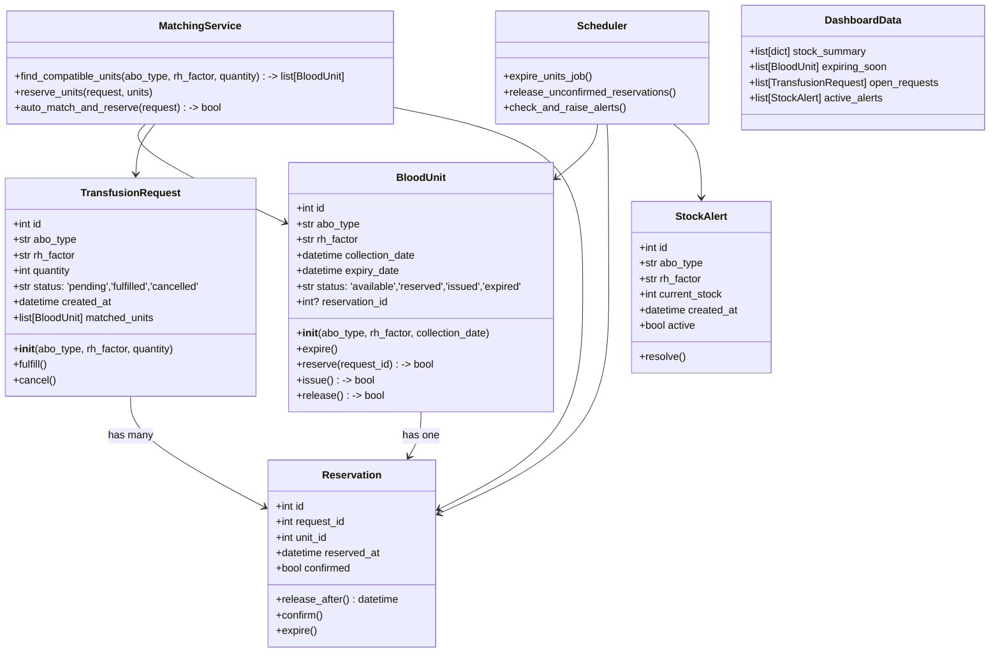
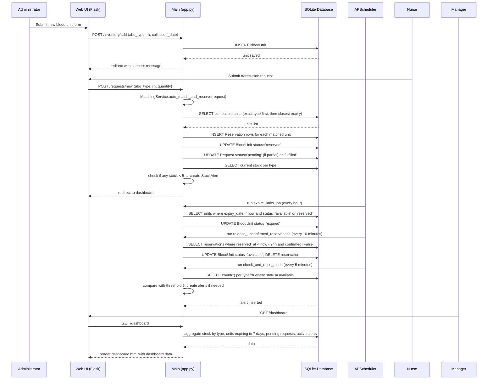

## Implementation approach

We will build a lightweight monolithic web application using Python Flask for the server, SQLAlchemy with SQLite for persistence, and APScheduler for background tasks (auto-expiry and reservation release). The frontend uses Jinja2 templates with Bootstrap for a clean responsive dashboard. The system exposes RESTful endpoints for inventory and request management while serving a server-rendered dashboard. For simplicity and easy deployment, we avoid heavy frontend frameworks. The complex matching algorithm is implemented in a dedicated service module, ensuring ACID compliance through database transactions.

## File list

- main.py
- config.py
- app/models.py
- app/routes.py
- app/matching_service.py
- app/scheduler.py
- app/forms.py
- templates/base.html
- templates/dashboard.html
- templates/inventory.html
- templates/requests.html
- templates/alerts.html
- static/css/style.css
- static/js/main.js

## Data structures and interfaces

## Program call flow

## Anything UNCLEAR

Clarification needed on Rh compatibility rules. Standard transfusion practice: Rh-negative can only receive Rh-negative blood; Rh-positive can receive Rh-positive or Rh-negative. However, the requirement states 'standard ABO/Rh donor compatibility' – we will implement exactly that. Also, the alert mechanism is currently dashboard-based; future integrations (email/SMS) can be added as separate services. User authentication and role-based access (admin, nurse, technician) are not explicitly requested but would be necessary for a production system; we assume they are out of scope for this version, but the architecture allows easy integration of Flask-Login later.

